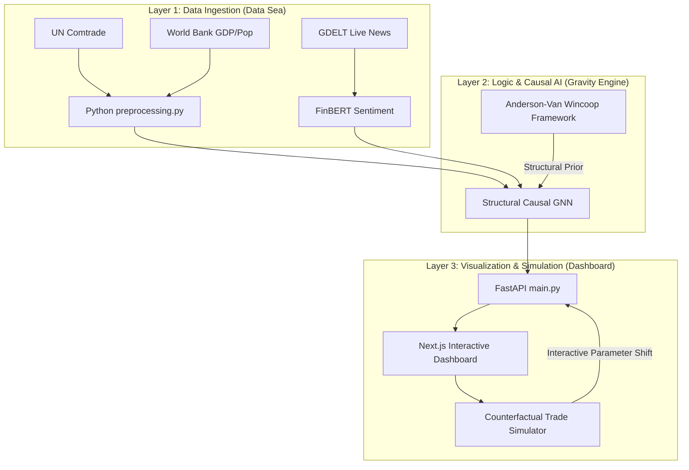

# 📊 System Architecture Visuals

This document provides a comprehensive overview of the GNN Trade Forecasting system's design and theoretical foundations.

## **1. Conceptual Architecture**
This visualization illustrates the three-tier hierarchy of the project: **Input Feeds**, the **Structural Gravity Core**, and the **Interactive Intelligence Dashboard**.

---

## **2. Technical Logic Flow**
This diagram tracks the data journey through the software stack.

---

## **3. Scientific Foundation**

### **The Anderson-Van Wincoop (AW) Framework**
Our prediction engine is built on the **AW Structural Gravity Framework**, which is the academic gold standard for trade modeling.

- **Standard Gravity**: Proposes that trade is simply a result of size (GDP) and distance.
- **Structural Gravity (AW)**: Introduced the concept of **Multilateral Resistance (MR)**. It posits that trade between two nations is determined by their relative trade barriers compared to the barriers they face with the *rest of the world*.
- **In this AI**: The GNN doesn't just calculate local distances; it learns a global resistance tensor that ensures trade predictions remain in a balanced equilibrium, even when simulating disruptive market shocks.
