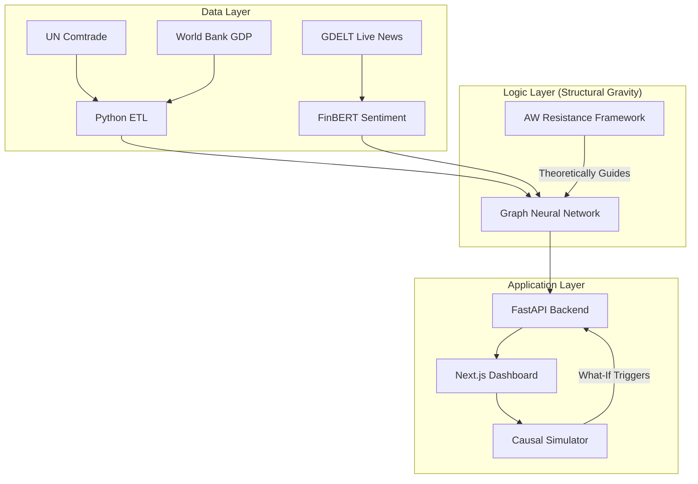

# 🌍 GNN Trade Forecasting Workflow

A streamlined guide to the 7-stage architecture of our Hybrid Causal Trade Simulation system.

## **Architecture Overview**
This system combines **Graph Neural Networks (GNN)** with **Structural Gravity Theory** to provide real-time, explainable trade forecasts.

---

### **Scientific Foundation: Structural Gravity & AW**
Our engine is built on the **Anderson-Van Wincoop (AW) Framework**, which is the academic "gold standard" for the **Gravity Model of Trade**.

- **Basic Gravity**: Trade ≈ (Mass₁ × Mass₂) / Distance.
- **The AW Improvement**: Realized that trade depends on **Multilateral Resistance**. It’s not just about how far India is from the USA, but how far India is from *every other market* simultaneously.
- **In this Project**: The GNN learns these "Resistance Tensors" to predict how global shocks (like a sentiment shift or GDP change) ripple through the entire trade network to reach an equilibrium.

---

### **1. Data Intelligence (ETL)**
- **Sources**: UN Comtrade (Trade Flows), World Bank (GDP/Pop), CEPII (Distances).
- **Process**: Automated cleanup and merging into periodic graph snapshots.
- **Output**: `data/processed/` nodes and edges.

### **2. News & Sentiment Engine**
- **Live GDELT Integration**: Triggers on-demand news fetching for specific trade partners.
- **FinBERT Analysis**: Real-time sentiment scoring of financial headlines to adjust trade weights.

### **3. Causal AI Model**
- **Structural Gravity Engine**: Instead of a blind black-box, the model uses an **Anderson-Van Wincoop framework**. It learns how "Economic Mass" (GDP) and "Trade Friction" (Distance/Sentiment) interact to form a stable trade equilibrium.
- **Transformer Attention**: Discovers hidden trade dependencies between countries.

### **4. Real-Time API (Backend)**
- **FastAPI**: High-performance engine with graph pre-caching.
- **Intelligence**: Generates top predictions, alerts, and strategic recommendations on-the-fly.

### **5. Interactive Dashboard (Frontend)**
- **Visuals**: Real-time charts, global trade maps, and sentiment feeds.
- **Simulation**: "What-if" triggers for GDP shocks, tariff changes, and sentiment shifts.

### **6. Explainability (XAI)**
- **Attention Weights**: Visualizes which countries are influencing a specific sector.
- **Global Importance**: Ranks which factors (e.g., Distance vs Sentiment) are driving the model.

### **7. Deployment & Portability**
- **Run Script**: `./run.sh` handles the entire ecosystem setup.
- **Portable**: Models and data are included in the repository for "Clone and Run" access.

---

## **System Architecture Diagram**

**Status**: [LIVE] All systems operational.